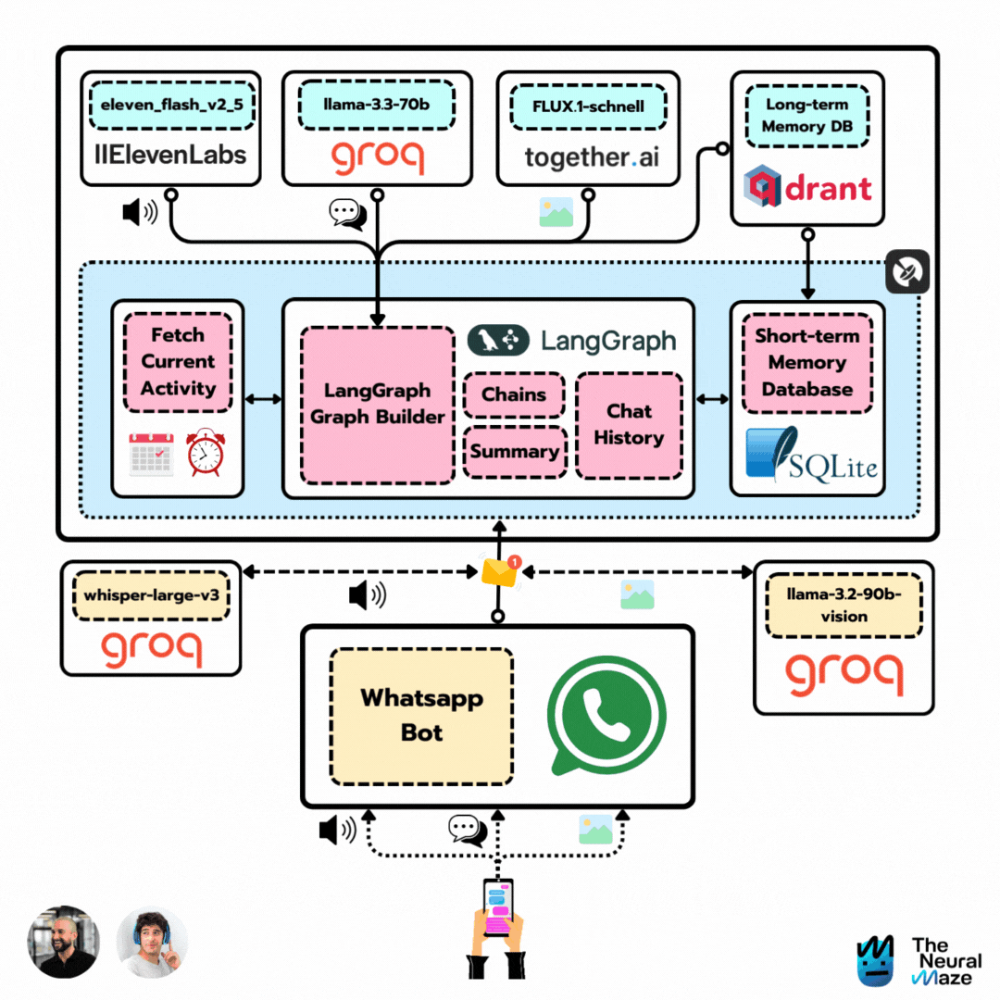

        
    <h1 align="center">📱 Ava 📱</h1>
    <h3 align="center">Turning the Turing Test into a Whatsapp Agent</h3>

    

## Table of Contents

- [1. Course Overview](#course-overview)
- [2. The tech stack](#the-tech-stack)
- [2. Course Outline](#course-outline)
    - [Lesson 0 - Before we begin](#️-lesson-0-before-we-begin)
    - [Lesson 1 - Project overview](#️-lesson-1-project-overview)    
    - [Lesson 2 - Ava's brain is just a graph](#️-lesson-2-avas-brain-is-just-a-graph)
    - [Lesson 3 - Unlocking Ava's memories](#-lesson-3-unlocking-avas-memories)
    - [Lesson 4 - Giving Ava a Voice](#️-lesson-4-giving-ava-a-voice)
    - [Lesson 5 - Ava learns to see](#-lesson-5-ava-learns-to-see)
    - [Lesson 6 - Ava installs Whatsapp](#-lesson-6-ava-installs-whatsapp)
- [3. Contributors](#contributors)
- [4. License](#license)

## Course Overview

    

What happens when [two ML Engineers](#contributors) with a love for sci-fi movies team up? 🤔

You get **Ava**, a Whatsapp agent that can engage with users in a "realistic" way, inspired by the great film [Ex Machina](https://www.imdb.com/es-es/title/tt0470752/). Ok, you won't find a fully sentient robot here, but you **will** have some pretty interesting Whatsapp conversations.

>You can think of it as a modern reinterpretation of the Turing Test 🤣

By the end of this course, you'll have built your own Ava too, capable of:

* Receiving and sending Whatsapp messages 📲
* Understanding your voice 🗣️
* Recognizing your images 🖼️
* Sending voice notes back 🎤
* Sharing updates about its "daily activities" 🚣
* Sending you images of its current activities 🖼️

Excited? Let's get started! 

## The tech stack

<table>
  <tr>
    <th>Technology</th>
    <th>Description</th>
  </tr>
  <tr>
    <td></td>
    <td>Powering the project with Llama 3.3, Llama 3.2 Vision, and Whisper. Groq models are awesome (and fast!!)</td>
  </tr>
  <tr>
    <td></td>
    <td>Serving as the long-term database, enabling our agent to recall details you shared months ago.</td>
  </tr>
  <tr>
    <td></td>
    <td>A cost-effective, serverless solution to bring everything into production.</td>
  </tr>
  <tr>
    <td></td>
    <td>Learn how to build production-ready LangGraph workflows</td>
  </tr>
  <tr>
    <td></td>
    <td>Amazing TTS models</td>
  </tr>
  <tr>
    <td></td>
    <td>Behind Ava's image generation process</td>
  </tr>
</table>

## Course Outline

This course is divided into 6 lessons. Each lesson is a step forward in building Ava, and it has a written and video version. 

These two versions are complementaty, so we recommend you to go through both, as it will improve your learning experience. Don't forget to check the [Before we start](#before-we-start) section to get everything ready for the course.

### 🛠️ Lesson 0: Before we begin

> WIP ... 👷

### 🏗️ Lesson 1: Project overview

> WIP ... 👷

### 🕸️ Lesson 2: Ava's brain is just a graph

> WIP ... 👷

### 🧠 Lesson 3: Unlocking Ava's memories
        
WIP 👷

### 🗣️ Lesson 4: Giving Ava a Voice

> WIP ... 👷

### 👀 Lesson 5: Ava learns to see

> WIP ... 👷

### 📱 Lesson 6: Ava installs Whatsapp

> WIP ... 👷

## Contributors

<table>
  <tr>
    <td></td>
    <td>
      <strong>Miguel Otero Pedrido | Senior ML / AI Engineer </strong> 
      <i>Founder of The Neural Maze. Rick and Morty fan.</i>  
      <a href="https://www.linkedin.com/in/migueloteropedrido/">LinkedIn</a> 
      <a href="https://www.youtube.com/@TheNeuralMaze">YouTube</a> 
      <a href="https://theneuralmaze.substack.com/">The Neural Maze Newsletter</a>
    </td>
  </tr>
  <tr>
    <td></td>
    <td>
      <strong>Jesús Copado | Senior ML / AI Engineer </strong> 
      <i>Created "Her". Agentic lover and Youtuber.</i>  
      <a href="https://www.linkedin.com/in/copadojesus/">LinkedIn</a> 
      <a href="https://www.youtube.com/@jesuscopado-en">YouTube</a>
    </td>
  </tr>
</table>

## License

This project is licensed under the MIT License - see the [LICENSE](LICENSE) file for details.